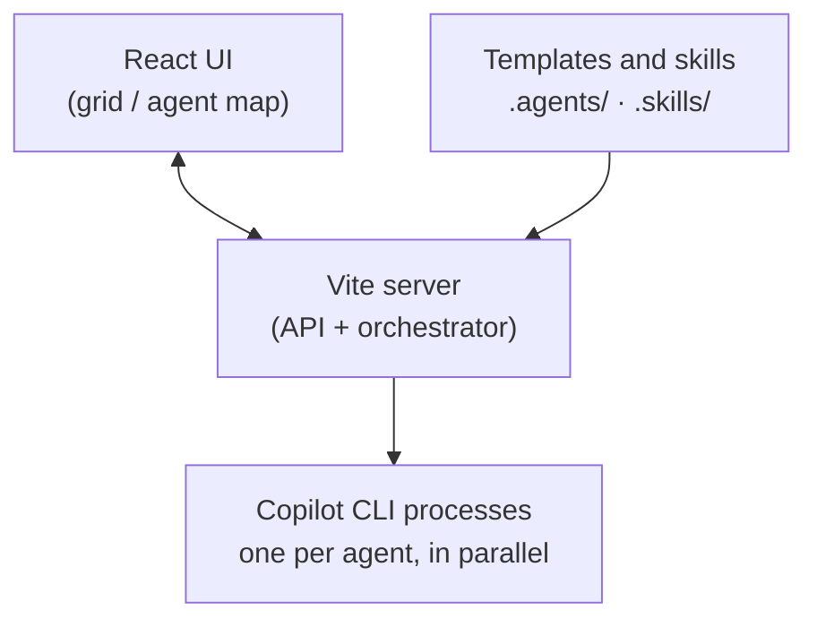

# AgentColony

[](https://github.com/dierodfer/AgentColony/actions/workflows/ci.yml)


**Local** web app that runs up to **8 GitHub Copilot CLI agents in
parallel**. It shows **all** of their responses at once, in a dark,
minimalist grid. Type a question and watch each agent answer in its own
way, based on its model, template and skills.

> ⚠️ Built for **local execution** with `npm run dev`. Not meant to be
> deployed to production or exposed to the internet: it orchestrates
> `copilot` processes on your machine.


## Requirements

| Requirement | Version / note |
|-----------|----------------|
| **Node.js** | `20+` |
| **npm** | bundled with Node |
| **[GitHub Copilot CLI](https://docs.github.com/copilot)** (`copilot`) | installed, on your `PATH` and **authenticated**. Requires an active GitHub Copilot subscription. |

Check you have everything with:

```bash
node --version      # >= 20
copilot --version   # should respond
make check          # checks Node + Copilot CLI in one go
```

The app **doesn't manage credentials**: it uses your local `copilot`
session, already authenticated. There are no tokens or keys in this
repository.

## Getting started

```bash
npm install
npm run dev
```

Open <http://localhost:5173>.

With `make`:

```bash
make setup   # checks requirements + npm install
make dev     # starts the app
```

## Agents and models

Each agent runs as an independent process via [GitHub Copilot
CLI](https://docs.github.com/copilot). Models are loaded **on demand** from
the "Reload models" button in the agent form; there's no default list.

## How it works

A Vite plugin ([`server/vite-plugin.ts`](server/vite-plugin.ts)) serves the
frontend and orchestrates the agents — no separate backend server needed.
Submitting a question calls `POST /api/run`, which streams back real-time
updates. The server spawns one `copilot -p` process per agent and tracks its
progress (`thinking → responding → finished`/`error`). Cancelling stops
every process right away.

### Architecture



## Agent configuration

Create, edit and delete specialists from the UI (up to 8). Agent templates
live in **`.agents/*.md`** and reusable skills in **`.skills/*.md`** (both
tracked in git). The current team is saved to **`.tmp/agent.config.json`**
(not versioned). `.md` files are detected and loaded automatically.

Skills support an optional **`applyTo`** frontmatter field, using the same
format GitHub Copilot uses for path-specific instructions: a comma-separated
list of glob patterns, e.g. `applyTo: "**/*.java, **/pom.xml"`. It's just a
hint shown in the UI — nothing gets filtered automatically.

## Structure

- **`.agents/`** — agent templates (`.md`)
- **`.skills/`** — reusable skills (`.md`)
- **`.tmp/`** — local runtime state (not versioned)
- **`server/`** — Vite plugin: API and Copilot CLI orchestration
- **`src/`** — React + Tailwind frontend

## Scripts

| Script | Action |
|--------|--------|
| `npm run dev` | Starts Vite (frontend + API) |
| `npm run build` | Type-check (`tsc -b`) + production frontend build |
| `npm run lint` | Oxlint |
| `npm run preview` | Serves the production build |

## Troubleshooting

- **`copilot: command not found`** → install [GitHub Copilot CLI](https://docs.github.com/copilot) and make sure it's on your `PATH`.
- **Agents fail instantly (`error`)** → your Copilot session isn't authenticated or you don't have an active subscription. Check with `copilot --version` and log in again.
- **A model doesn't respond** → it may not be available on your account; try `auto` or check `server/models.ts`.
- **Port 5173 is busy** → Vite will pick another port; check the URL it prints on startup.
