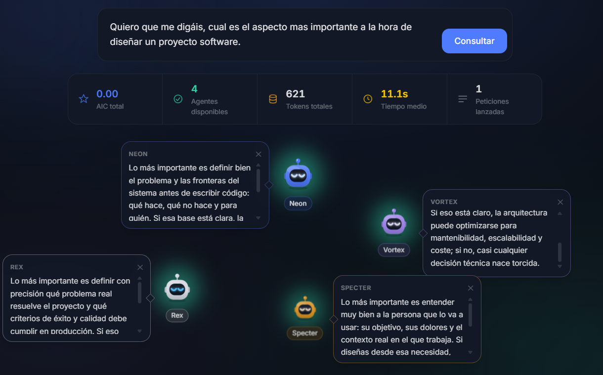
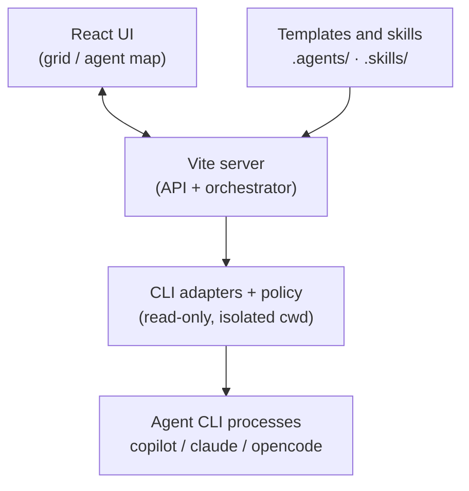

<p align="center">
  
</p>

# AgentColony

[](https://github.com/dierodfer/AgentColony/actions/workflows/ci.yml)


**Local** web app that runs up to **8 CLI agents in parallel**. Each agent
runs on the CLI of your choice — **GitHub Copilot CLI**, **Claude Code** or
**opencode** — and they all answer the same question at once, in a dark,
minimalist grid. Type a question and watch each agent respond in its own way,
based on its CLI, model, template and skills. On the **agent map** you can
drag two robots together with a thread so they **share memory** (skills +
each other's previous answers).

> ⚠️ Built for **local execution** with `npm run dev`. Not meant to be
> deployed to production or exposed to the internet: it spawns agent CLI
> processes on your machine. Agents run **read-only** (see [Security
> model](#security-model)), but don't expose the dev server with `--host`.



## Requirements

| Requirement | Version / note |
|-----------|----------------|
| **Node.js** | `20+` |
| **npm** | bundled with Node |
| **At least one agent CLI** | one of [GitHub Copilot CLI](https://docs.github.com/copilot) (`copilot`), [Claude Code](https://code.claude.com) (`claude`) or [opencode](https://opencode.ai) (`opencode`) — installed, on your `PATH` and **authenticated**. Pick each agent's CLI in the edit form and use **"Check availability"** to verify it. |

Check you have everything with:

```bash
node --version      # >= 20
copilot --version   # (or) claude --version / opencode --version
make check          # checks Node + Copilot CLI in one go
```

The app **doesn't manage credentials**: it uses your locally authenticated
CLI session (copilot / claude / opencode). There are no tokens or keys in
this repository.

## Getting started

```bash
npm install
npm run dev
```

Open <http://localhost:5173>.

With `make`:

```bash
make setup   # checks requirements + npm install
make dev     # starts the app
```

## Agents and models

Each agent runs as an independent CLI process. The CLI (copilot / claude /
opencode) is chosen per agent in the edit form. Models for **copilot** are
loaded **on demand** from the "Reload models" button; there's no default
list. claude / opencode use their own model ids (or `auto`).

## How it works

A Vite plugin ([`server/vite-plugin.ts`](server/vite-plugin.ts)) serves the
frontend and orchestrates the agents — no separate backend server needed.
Submitting a question calls `POST /api/run`, which streams back real-time
updates. Each CLI is abstracted behind an **adapter**
([`server/cli-adapters.ts`](server/cli-adapters.ts)) that knows its binary,
arguments and output format; the orchestrator spawns one process per agent and
tracks its progress (`thinking → responding → finished`/`error`). Cancelling
stops every process right away.

### Architecture



### Security model

Agents are **read-only Q&A**: they must never write files or run shell
commands. Enforcement is **per-CLI** and centralized in
[`server/cli-policy.ts`](server/cli-policy.ts):

| CLI | How read-only is enforced |
|-----|---------------------------|
| **copilot** | `--deny-tool write` + `--deny-tool shell` |
| **claude** | `--permission-mode dontAsk` + `--disallowedTools "Bash,Write,Edit,…"` (hard deny rules) |
| **opencode** | `OPENCODE_CONFIG` → bundled profile with `permission: { edit/bash/write/patch: "deny" }` |

As a CLI-agnostic safety belt, every process also runs in an **isolated,
empty working directory** (under the OS temp dir, outside the repo), so a CLI
can't discover the project's config (`CLAUDE.md`, `.mcp.json`, `opencode.json`,
hooks) by walking up from the cwd. Both the read-only flags and the cwd
isolation are defined per CLI in `cli-policy.ts` and are designed to be
**user-configurable in the future** (a single `loadUserOverrides()` seam).

## Agent configuration

Create, edit and delete specialists from the UI (up to 8). Agent templates
live in **`.agents/*.md`** and reusable skills in **`.skills/*.md`** (both
tracked in git). The current team is saved to **`.tmp/agent.config.json`**
(not versioned). `.md` files are detected and loaded automatically.

Skills support an optional **`applyTo`** frontmatter field, using the same
format GitHub Copilot uses for path-specific instructions: a comma-separated
list of glob patterns, e.g. `applyTo: "**/*.java, **/pom.xml"`. It's just a
hint shown in the UI — nothing gets filtered automatically.

## Structure

- **`.agents/`** — agent templates (`.md`)
- **`.skills/`** — reusable skills (`.md`)
- **`.tmp/`** — local runtime state: team + memory links (not versioned)
- **`server/`** — Vite plugin: API and agent orchestration
  - `cli-adapters.ts` — per-CLI binary/args/output-parsing adapters
  - `cli-policy.ts` — read-only security policy + isolated cwd (configurable)
  - `cli-profiles/` — bundled CLI configs (e.g. opencode read-only)
- **`src/`** — React + Tailwind frontend (`lib/clis.ts` = shared CLI descriptors)

## Scripts

| Script | Action |
|--------|--------|
| `npm run dev` | Starts Vite (frontend + API) |
| `npm run build` | Type-check (`tsc -b`) + production frontend build |
| `npm run lint` | Oxlint |
| `npm test` | Unit tests (Vitest) |
| `npm run preview` | Serves the production build |

## Troubleshooting

- **`<cli>: command not found`** → install the agent's CLI (copilot / claude / opencode) and make sure it's on your `PATH`. Use **"Check availability"** in the edit form to verify.
- **Agents fail instantly (`error`)** → that agent's CLI isn't authenticated (or lacks an active subscription). Check with `<cli> --version` and log in again.
- **A model doesn't respond** → it may not be available on your account; try `auto` or, for copilot, reload models.
- **Port 5173 is busy** → Vite will pick another port; check the URL it prints on startup.
